<div align="center">

# Watari

**Open-source case management for the people who actually work the incidents.**

Multi-tenant. Real-time. OCSF-native. Runs on your laptop in one command.

[](LICENSE)
[](backend/pyproject.toml)
[](frontend/package.json)
[](https://schema.ocsf.io/1.8.0/classes/detection_finding)
[](#project-status)
[](CONTRIBUTING.md)

[Quickstart](#quickstart-60-seconds) · [Screenshots](#the-tour) · [Integration guide](docs/integration.md) · [Contributing](CONTRIBUTING.md)

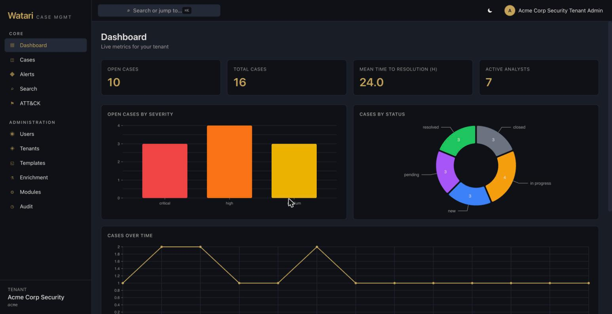

</div>

---

## Quickstart (60 seconds)

You need Docker. That's it.

```bash
git clone https://github.com/BlueSquadron/Watari.git
cd Watari
./bootstrap.sh
```

That single command brings up the whole stack, applies migrations, and loads a
realistic demo dataset — two tenants, 13 users, 32 cases, 20 OCSF alerts,
observables with geolocation, ATT&CK mappings, evidence, and notes.

When it finishes it prints where to go:

| | |
|---|---|
| **Web UI** | http://localhost:5173 |
| **API docs** (Swagger) | http://localhost:8000/docs |
| **MinIO console** | http://localhost:9001 — `minioadmin` / `minioadmin` |

Sign in with any of the seeded accounts:

| Username | Password | Role |
|---|---|---|
| `acme-admin` | `password` | **Tenant admin — start here** |
| `acme-analyst1` · `2` · `3` | `password` | Analyst |
| `acme-viewer` | `password` | Read-only |
| `admin` | `admin` | Platform admin (sees every tenant) |
| `globalbank-admin` · `-analyst1..3` · `-viewer` | `password` | Same roles, second tenant |

> These are development credentials seeded for the demo. Never deploy them.

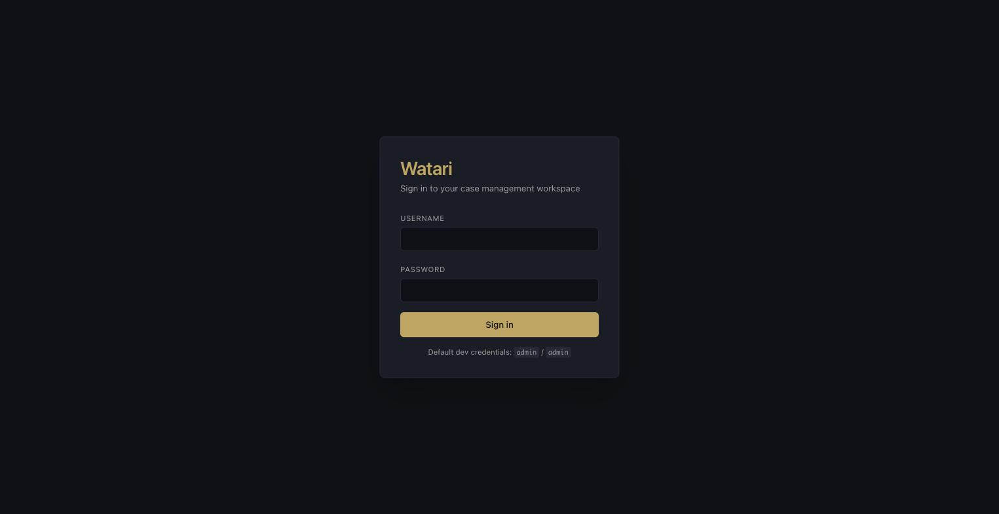

You now have a fully populated SOC to click around in.

<details>
<summary><b>Other ways to run it</b></summary>

```bash
./bootstrap.sh --reset     # wipe volumes and rebuild from zero
./bootstrap.sh --no-seed   # start empty, no demo data
docker compose down        # stop everything
docker compose up -d       # start it again
```

Prefer the Makefile? `make dev && make db-migrate && make db-seed` does the same
thing step by step. `make help` lists every target.
</details>

<details>
<summary><b>Something went wrong</b></summary>

| Symptom | Fix |
|---|---|
| `Docker is installed but not running` | Start Docker Desktop / OrbStack / Colima and re-run. |
| API never becomes healthy | `docker compose logs api` — usually a port 8000 conflict. |
| Frontend stuck on "starting" | First run installs npm packages inside the container. Watch it: `docker compose logs -f frontend`. |
| Ports already in use | Watari binds 5173, 8000, 5432, 6379, 9000, 9001. Free them or edit `docker-compose.yml`. |
| Want a clean slate | `./bootstrap.sh --reset` |

Still stuck? [Open an issue](https://github.com/BlueSquadron/Watari/issues/new/choose) — setup friction is a bug, and we'd like to hear about it.
</details>

---

## What is Watari?

Watari is an incident response and case management platform for SOC analysts,
CSIRTs, and CERTs. It is named after the butler from *Death Note* — the quiet,
reliable one who handles the operational complexity so the investigator can
think.

It sits where TheHive and DFIR-IRIS sit, with three things it does differently:

- **Real multi-tenancy.** Tenant isolation is designed around PostgreSQL
  Row-Level Security at the database level rather than a `customer` column
  alone — one deployment, many customers. *(The policies ship, but aren't
  enforced yet — see [Project status](#project-status).)*
- **OCSF-native ingestion.** Alerts are [OCSF 1.8.0 Detection
  Findings](https://schema.ocsf.io/1.8.0/classes/detection_finding). Any
  compliant producer — Wazuh, Suricata, CrowdStrike, AWS Security Hub, your
  own detector — POSTs straight to the API without a translation layer.
- **Built for looking at things.** Entity graphs, ATT&CK heatmaps, swimlane
  timelines, and geospatial views are first-class, not bolt-ons.

### Project status

**Alpha (v0.1.0).** The data model, API surface, and multi-tenancy are
substantial and covered by 29 property-based test suites. The UI is complete
enough to work a case end to end. Expect rough edges, and expect the schema to
move before 1.0.

The one gap worth knowing before you deploy anything real: **Row-Level Security
is shipped but not enforced.** The policies are correct, but the application
connects as a superuser and the tables aren't `FORCE`d, so tenant isolation
currently rests on the service layer's own `tenant_id` predicates rather than
on the database. Tracked in
[#4](https://github.com/BlueSquadron/Watari/issues/4).

See [known gaps](CONTRIBUTING.md#known-gaps--good-first-issues) for the rest —
several are excellent first contributions.

---

## The tour

### Work the queue

Alerts arrive as OCSF Detection Findings, get deduplicated, and wait for triage.
Promote one to a case or dismiss it with a reason — either way it's on the record.

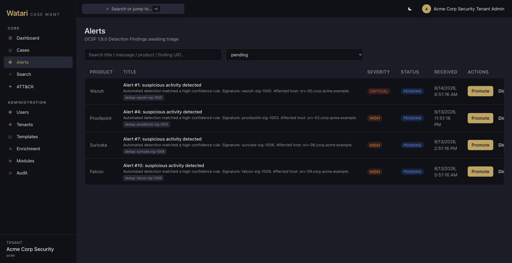

Every alert keeps its full OCSF envelope — finding info, analytic, confidence,
vendor metadata — so nothing is lost between the detector and the case.

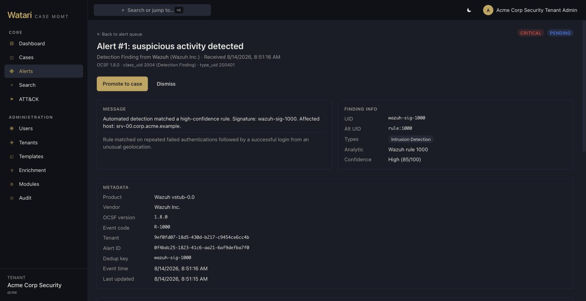

### Run the case

Cases carry severity, status, assignee, and a full lifecycle from new through
resolved to closed.

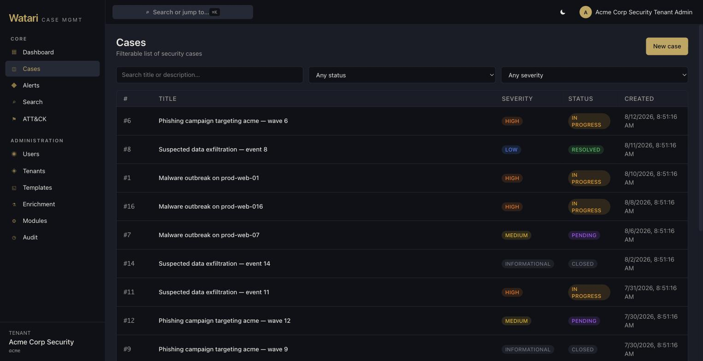

Each case opens onto everything attached to it — timeline, swimlane, graph, map,
ATT&CK, observables, assets, evidence, notes, tasks, and reports.

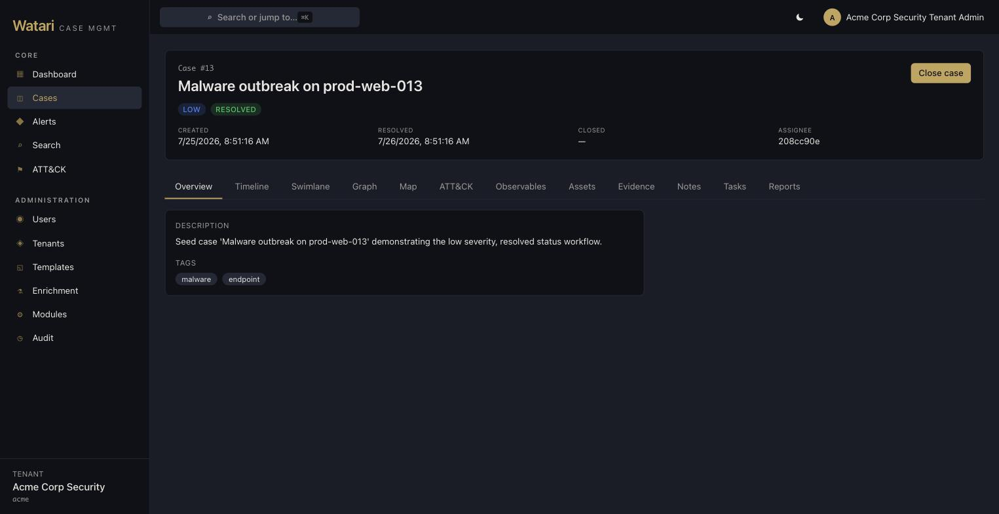

### Reconstruct what happened

The timeline records itself. Case creation, status transitions, observables,
assets, task movement — every one lands automatically, and analysts add manual
entries for the things only a human saw.

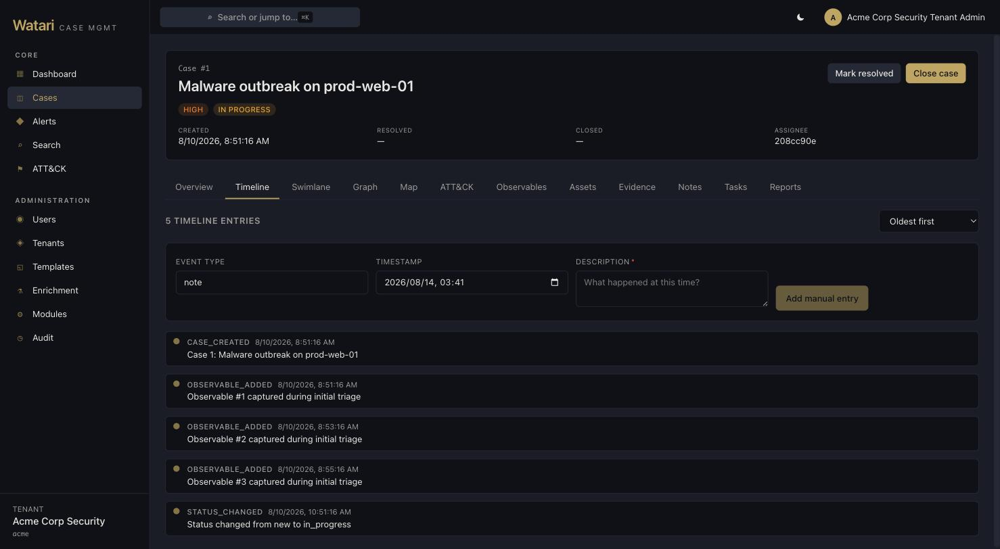

The same events on a swimlane, one lane per actor or asset, with bursts of
activity clustered automatically. Scroll to zoom, drag to pan.

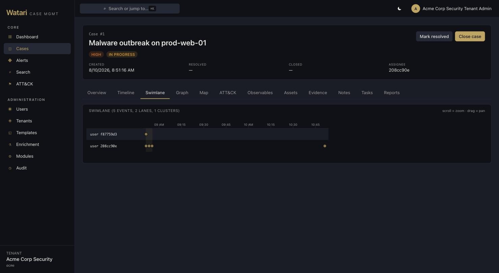

And as a graph: the case at the centre, everything it contains around it, and
dashed edges out to the other cases that share an indicator with it.

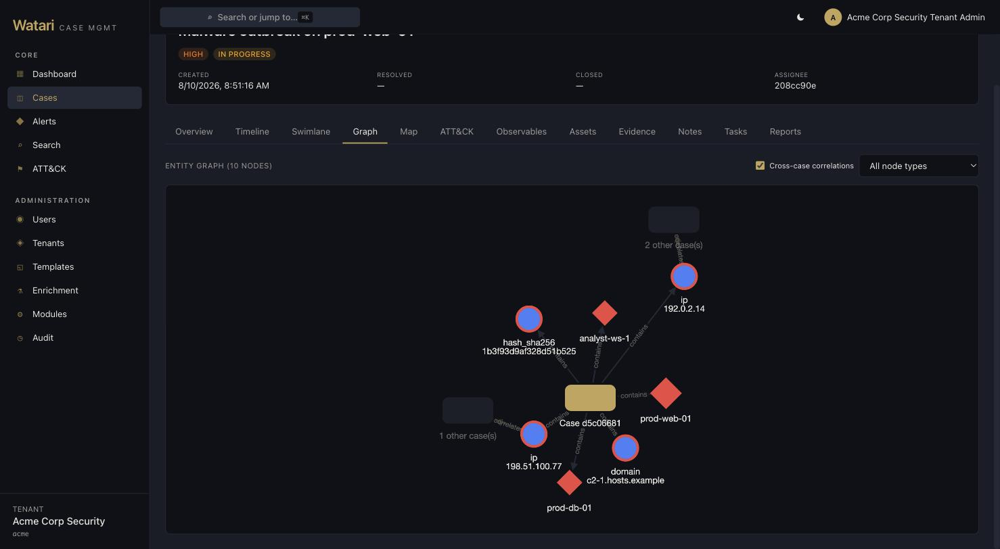

### Track the indicators

Observables are format-validated, TLP-classified, flagged as IOCs, and
correlated across cases — the *seen in* column tells you when an indicator has
shown up in an investigation you didn't run.

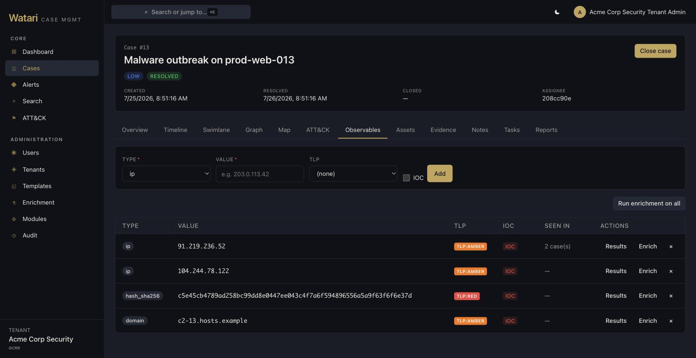

Enrichment sources are configured per tenant and queried asynchronously, so a
slow or dead intel provider never blocks the analyst.

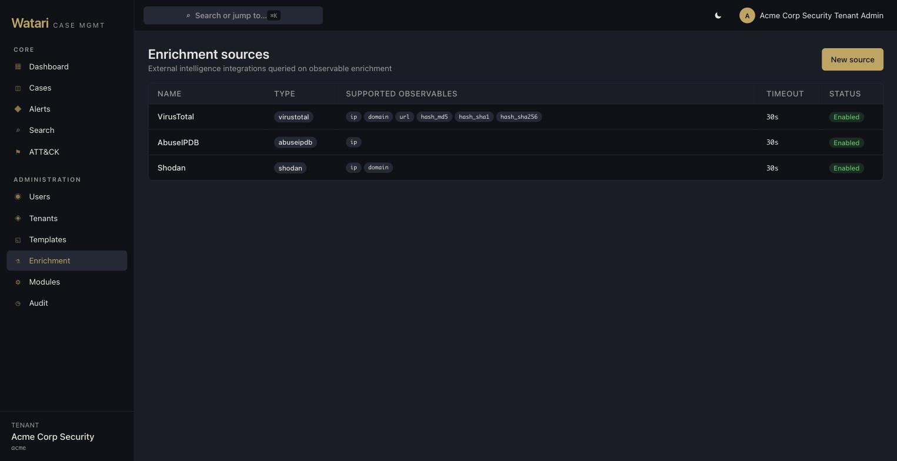

### See the shape of the campaign

Technique coverage across the tenant, mapped to MITRE ATT&CK tactics.

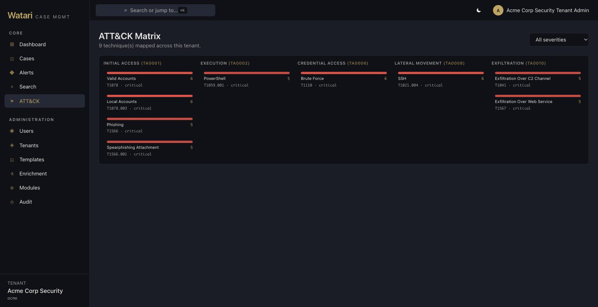

The same matrix is available scoped to a single case, so you can see which
techniques that one intrusion actually touched.

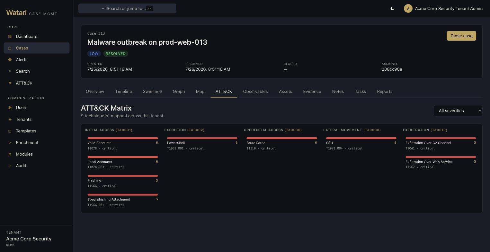

### Move fast

`Cmd`/`Ctrl` + `K` from anywhere — jump to a case, an observable, or a page
without touching the mouse.

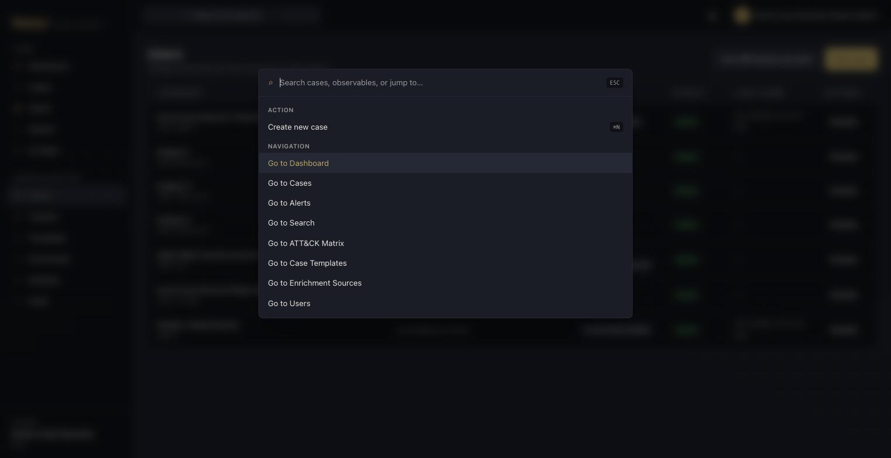

Or search everything at once — cases, observables, assets, notes and alerts —
grouped by type, with each hit linking back to the case it belongs to.

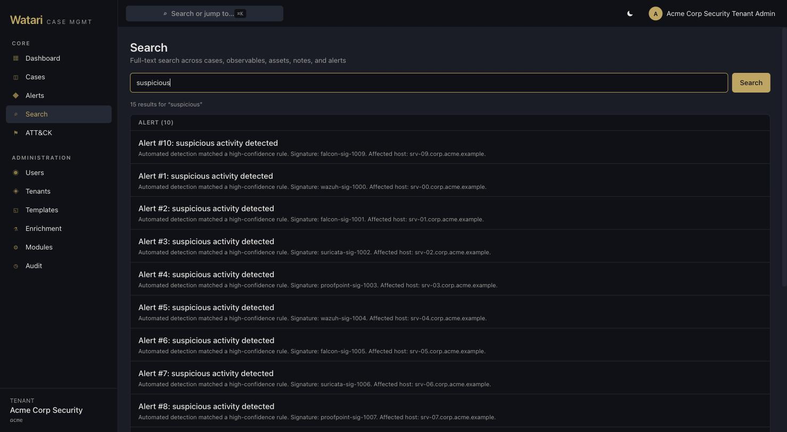

### Keep tenants apart

Platform admins manage tenants and switch between them. Everyone else never
sees another tenant exists.

> **Alpha caveat:** every tenant-scoped query carries its own `tenant_id`
> predicate, and the Postgres Row-Level Security policies meant to back that up
> are in place — but they are not currently enforced, because the app connects
> as a superuser and the tables aren't `FORCE`d. Isolation today rests on the
> application layer alone. Tracked in
> [#4](https://github.com/BlueSquadron/Watari/issues/4).

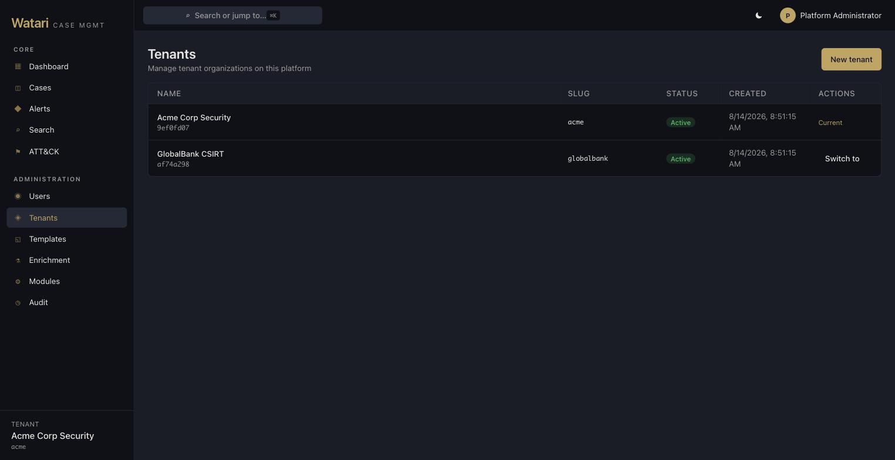

Per-tenant users, roles, and API service accounts:

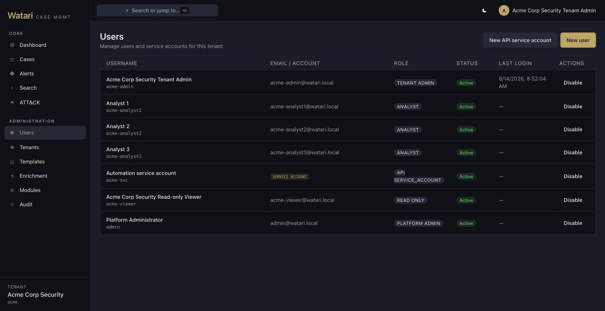

### Standardise the work

Case templates seed a new investigation with the right severity, tags, and task
checklist.

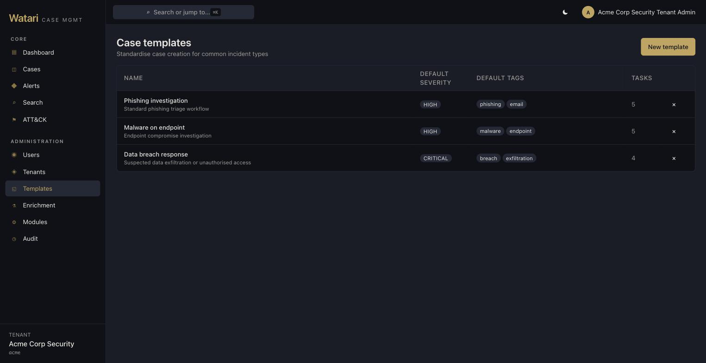

### And it does light mode

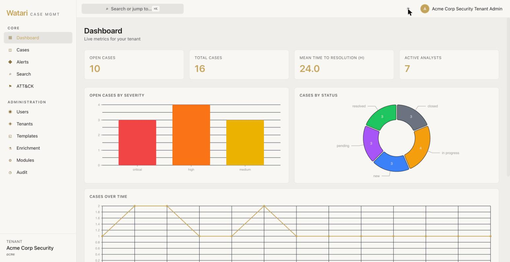

---

## Features

| | |
|---|---|
| **Case management** | Full lifecycle, templates, tasks, outcome classification, case merging |
| **Multi-tenancy** | PostgreSQL Row-Level Security, per-tenant fields, templates, and enrichment config |
| **Observables** | IPs, domains, hashes, URLs, emails; format validation, TLP marking, cross-case correlation |
| **Enrichment** | Pluggable external sources (VirusTotal, AbuseIPDB, Shodan, MISP, IntelOwl), async with failure isolation |
| **Assets & evidence** | Compromised system tracking, SHA256 integrity verification, encrypted storage, chain of custody |
| **Timeline** | Automatic + manual events, swimlane visualisation, temporal clustering, asset linking |
| **Real-time** | WebSocket live updates, presence, activity feed, notifications |
| **Visualisations** | Entity relationship graph, ATT&CK heatmap, geospatial IP map, swimlane timeline |
| **Alerts** | OCSF 1.8.0 ingestion, deduplication, triage, promotion to case |
| **Reports** | Templated investigation and activity reports in DOCX, Markdown, and HTML |
| **Extensibility** | Pipeline modules (evidence processing) and processor modules (event-driven automation) |
| **Notes** | Markdown notes with folders, embedded images, internal entity links |
| **API** | Versioned REST + OpenAPI, JWT for humans, API keys for machines |
| **Identity** | Local accounts, OIDC (Keycloak, Okta, Entra ID, Google), SAML 2.0 |
| **Audit** | Immutable audit trail across every user and service-account action |

### How it compares

| | TheHive | DFIR-IRIS | FIR | Catalyst | **Watari** |
|---|---|---|---|---|---|
| Multi-tenant isolation | Limited | Customer field | No | No | **PostgreSQL RLS** \* |
| OCSF native ingest | No | No | No | No | **OCSF 1.8.0** |
| Real-time collaboration | No | No | No | No | **WebSocket** |
| Swimlane timeline | No | List view | No | No | **Visual + clustering** |
| Entity relationship graph | No | Basic | No | No | **Cytoscape.js** |
| ATT&CK heatmap | No | No | No | No | **Built in** |
| Geospatial mapping | No | No | No | No | **Leaflet** |
| Observable enrichment | Via Cortex | Via modules | No | No | **Built in, async** |
| Evidence integrity | No | Basic | No | No | **SHA256 + encryption** |
| Plugin system | Cortex | Python modules | No | Playbooks | **Pipeline + processor** |
| Command palette | No | No | No | No | **Cmd+K** |
| Stack | Scala/Play | Python/Flask | Python/Django | Go | **FastAPI + React 18** |

\* The RLS policies ship but are not enforced yet — see
[Project status](#project-status).

Watari is younger and less battle-tested than TheHive or DFIR-IRIS. If you need
something proven in production today, use those. If you want a modern stack and
you're willing to help shape it, you're in the right place.

---

## Architecture

```
┌──────────────────────────────────────────────────────────┐
│  Clients                                                 │
│  React 18 SPA (TypeScript, Tailwind, Radix)              │
│  API clients / service accounts                          │
└──────────────┬─────────────────────┬─────────────────────┘
               │                     │
┌──────────────▼─────────────────────▼─────────────────────┐
│  Application                                             │
│  FastAPI REST + OpenAPI  │  WebSocket hub  │  Celery     │
│  JWT · RBAC · API keys   │  (Redis PubSub) │  workers    │
└──────────────┬─────────────────────┬─────────────────────┘
               │                     │
┌──────────────▼─────────────────────▼─────────────────────┐
│  Data                                                    │
│  PostgreSQL 16 (RLS + FTS) │ Redis 7 │ S3 / MinIO        │
└──────────────────────────────────────────────────────────┘
```

**Backend** — Python 3.12, FastAPI, Pydantic v2, SQLAlchemy 2.0 (async), Celery, Authlib
**Frontend** — React 18, TypeScript, Tailwind, Radix UI, @visx, Cytoscape.js, @nivo, react-leaflet
**Data** — PostgreSQL 16, Redis 7, S3-compatible object storage
**Testing** — pytest + Hypothesis, 29 property-based suites covering tenant isolation, RBAC, TLP enforcement, evidence integrity, OCSF round-tripping, and more

<details>
<summary><b>Repository layout</b></summary>

```
watari/
├── bootstrap.sh              # one-command setup
├── docker-compose.yml
├── Makefile                  # make help
├── backend/
│   ├── src/
│   │   ├── api/routers/      # FastAPI routes, one module per entity
│   │   ├── auth/             # JWT, RBAC, OIDC, SAML, API keys
│   │   ├── models/           # SQLAlchemy 2.0 models
│   │   ├── schemas/          # Pydantic request/response schemas
│   │   ├── services/         # business logic
│   │   ├── realtime/         # WebSocket hub
│   │   ├── worker/           # Celery tasks
│   │   └── modules/          # plugin system
│   ├── alembic/              # migrations
│   ├── scripts/seed.py       # demo dataset
│   └── tests/                # pytest + Hypothesis
├── frontend/
│   └── src/
│       ├── pages/            # route pages
│       ├── components/       # layout, cases, visualizations, common
│       ├── api/              # client + React Query hooks
│       ├── stores/           # Zustand
│       └── realtime/         # WebSocket client
└── docs/
    ├── integration.md        # end-to-end API walkthroughs
    └── images/
```
</details>

---

## Using the API

Everything the UI does, the API does. Interactive docs at
http://localhost:8000/docs once you're running.

Ingest an alert from any OCSF-compliant detector:

```bash
curl -X POST http://localhost:8000/api/v1/tenants/{tenant_id}/alerts \
  -H "X-API-Key: your-api-key" \
  -H "Content-Type: application/json" \
  -d '{
    "activity_id": 1,
    "category_uid": 2,
    "class_uid": 2004,
    "severity_id": 4,
    "time": 1777189013919,
    "message": "8 failed SSH logins followed by a success from 203.0.113.42",
    "metadata": {
      "version": "1.8.0",
      "product": { "name": "Wazuh", "vendor_name": "Wazuh Inc." }
    },
    "finding_info": {
      "uid": "wazuh-5763-203.0.113.42",
      "title": "Brute force SSH detected"
    },
    "observables": [
      { "name": "src_endpoint.ip", "type_id": 2, "value": "203.0.113.42", "is_ioc": true },
      { "name": "dst_endpoint.hostname", "type_id": 1, "value": "prod-web-01" }
    ],
    "attacks": [
      { "tactic": { "uid": "TA0006" }, "technique": { "uid": "T1110" } }
    ],
    "dedup_key": "ssh-brute-203.0.113.42"
  }'
```

Responses use a consistent envelope:

```json
{
  "data": { },
  "meta": { "page": 1, "page_size": 25, "total_count": 142, "total_pages": 6 }
}
```

**→ [The integration guide](docs/integration.md)** walks through authentication,
service accounts, alert ingestion, deduplication, triage, case creation,
enrichment, evidence upload, report generation, and WebSocket streaming — with
copy-pasteable curl for each, plus a complete end-to-end script.

**→ [API coverage reference](backend/API_COVERAGE.md)** lists every endpoint and method.

### Plays well with

**Alert sources** — Wazuh, Suricata/Snort, Splunk, Elastic, QRadar, or anything that speaks HTTP
**SOAR** — Shuffle, Tracecat, n8n (Watari complements these rather than replacing them)
**Identity** — Keycloak, Okta, Entra ID, Google Workspace, any SAML 2.0 IdP
**Intel** — VirusTotal, AbuseIPDB, Shodan, MISP, IntelOwl, or your internal TIP via a custom module

Custom modules are ordinary Python classes:

```python
from watari.modules import BaseModule, ModuleAPI

class InternalTipModule(BaseModule):
    async def execute(self, context: ModuleAPI, config: dict, payload: dict) -> dict:
        observable = payload["observable"]
        result = await self.query_internal_tip(observable["value"])
        await context.add_timeline_entry(
            payload["case_id"],
            {"event_type": "enrichment", "description": f"Internal TIP: {result['verdict']}"},
        )
        return {"status": "success", "data": result}
```

---

## Roles

| Role | Scope | Can |
|---|---|---|
| Platform administrator | All tenants | Manage tenants, modules, platform settings; access all data |
| Tenant administrator | One tenant | Manage users, templates, enrichment sources, dashboards |
| Analyst | One tenant | Everything case-related: cases, tasks, observables, assets, evidence, notes, enrichment, reports |
| Read-only viewer | One tenant | Look, don't touch |
| API service account | One tenant | API only, no UI or WebSocket; analyst or read-only permissions |

---

## Contributing

Contributions are welcome and there is plenty of low-hanging fruit.

- **[CONTRIBUTING.md](CONTRIBUTING.md)** — dev environment, running tests, code style, PR process
- **[Known gaps and good first issues](CONTRIBUTING.md#known-gaps--good-first-issues)** — start here
- **[Code of Conduct](CODE_OF_CONDUCT.md)**
- **[Security policy](SECURITY.md)** — please report vulnerabilities privately

The fastest way to help: run `./bootstrap.sh`, click around, and
[open an issue](https://github.com/BlueSquadron/Watari/issues/new/choose) for
anything that surprises you.

---

## License

[Apache License 2.0](LICENSE) — free to use, modify, and distribute, including
commercially, with an explicit patent grant.

---

## Acknowledgments

Watari stands on the shoulders of the projects that made open-source incident
response normal:

- [TheHive](https://strangebee.com/thehive/) — the original open-source IR platform
- [Cortex](https://github.com/TheHive-Project/Cortex) — observable analysis and active response
- [DFIR-IRIS](https://dfir-iris.org/) — collaborative IR with timeline and evidence management
- [FIR](https://github.com/certsocietegenerale/FIR) — Fast Incident Response, by CERT Société Générale
- [OCSF](https://schema.ocsf.io/) — for making security events speak one language
